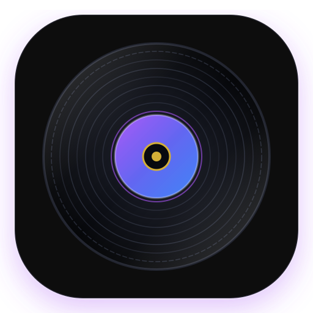

# Cadence 🎵

> A beautiful, local-first studio music player for Linux & Windows — Apple glass meets Material 3.



---

## ✨ Features

- **Apple Glass Meets Material 3 Design:** Frosted glassmorphic panels, dynamic ambient OKLab color palettes, refined typography, and macOS-style traffic lights.
- **Physics-Based Spinning Turntable Deck:** Real-time exponential angular velocity easing, ambient floor glow, and embedded album art disc labels.
- **64-Band Exponential FFT Visualizer:** Responsive audio frequency spectrum analyzer tuned across the human hearing range.
- **Native Local Audio Streaming Engine:** Custom `cadence://` protocol with HTTP partial-content range requests for instantaneous seek operations.
- **Format Support:** FLAC (Lossless 24-bit / 96kHz), WAV, MP3, M4A, OGG, OPUS, AAC, ALAC, AIFF.
- **D-Bus MPRIS2 & Hardware Media Keys:** Full system integration for media controls, lock screen player widgets, and hardware media keys.
- **Fast Recursive Scanner:** Instant metadata and cover art extraction via `music-metadata`.

---

## 🚀 Quick Start

### Development
```bash
# Install dependencies
npm install

# Run in development mode
npm run dev
```

### Production Build
```bash
# Build for Linux (AppImage & tar.gz)
npm run build:linux

# Build for Windows (Portable & NSIS installer)
npm run build:win
```

---

## 📦 Releases

- **Linux:** `release/Cadence-1.0.0.AppImage`
- **Windows:** `release/Cadence-1.0.0.exe` / `release/Cadence-Setup-1.0.0.exe`

---

## 📄 License
MIT © [Darnell](https://github.com/DRNZY)
